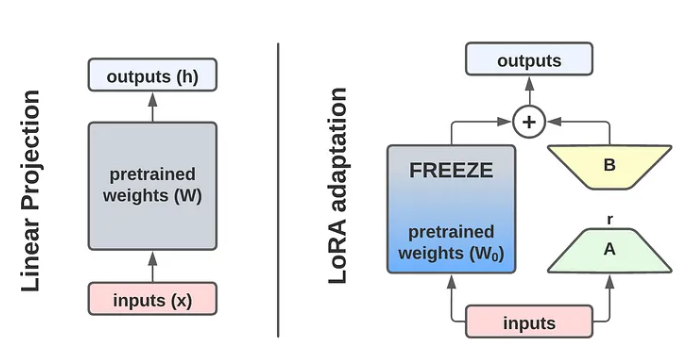

# lora4diffusion

## Introduction

从0到1手写基于mnist手写数字数据集的 lora for stable diffusion模型复现

## Preliminary
- **扩散模型的训练与采样过程**


## Architecture



## code

```python
    class LoraLinearLayer(nn.Module):
    r"""
    A linear layer that is used with LORA
    Args:
        rank: the rank of the lora layer.
        alpha: the alpha of the lora layer. 
        input_features: number of input features.
        out_features: number of output features.
        dtype: the device to use for the layer's weights.
        device: the dtyle to use for the layer's weights.
    """
    def __init__(self, raw_layer, rank, alpha, in_features, out_features):
        super(LoraLinearLayer, self).__init__()

        self.down = nn.Linear(in_features, rank, bias = False)
        self.up = nn.Linear(rank, out_features, bias = False)

        self.rank = rank
        self.alpha = alpha
        self.in_faetures = in_features
        self.out_features = out_features
        
        nn.init.normal_(self.down.weight, std = 1 / self.rank)
        nn.init.zeros_(self.up.weight)
    
        self.raw_layer = raw_layer

    def forward(self, hidden_states: torch.Tensor) -> torch.Tensor:
        r"""
        Perform lora forward process
        Args:
            hidden_states:  [B, L, C]
        Return:
            torch.Tensor:   [B, L, C]
        """
        original_dtype = hidden_states.dtype
        dtype = self.down.weight.dtype

        down_hidden_states = self.down(hidden_states.to(dtype))
        up_hidden_states = self.up(down_hidden_states)

        if self.alpha:
            up_hidden_states *= self.alpha / self.rank
        
        raw_output = self.raw_layer(hidden_states).to(original_dtype)
        final_out = raw_output + up_hidden_states.to(hidden_states)

        return final_out.to(original_dtype)
```


## Acknowledgements

- [Pytorch-diffusion](https://github.com/owenliang/pytorch-diffusion)
- [Stable Diffusion 原理介绍与源码分析](https://blog.csdn.net/Eric_1993/article/details/129600524?spm=1001.2014.3001.5501)
- [扩散模型(Diffusion Model)详解：直观理解、数学原理、PyTorch 实现](https://zhouyifan.net/2023/07/07/20230330-diffusion-model/)

